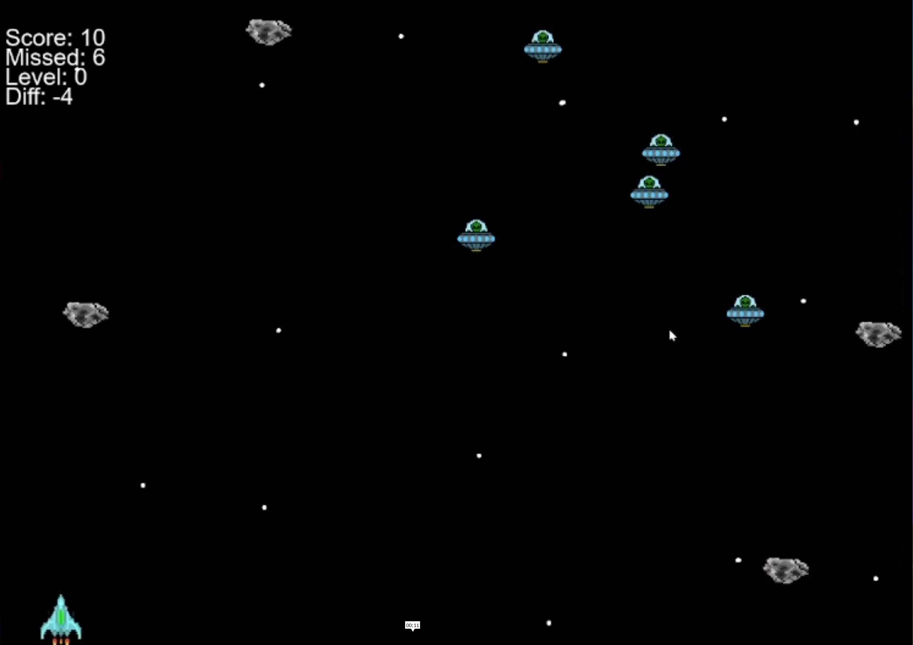

# Shooter Game Beta v1.02

A fast-paced space shooter where you defend the galaxy against invading UFOs and asteroids. Dodge enemies, shoot your way through waves, and survive as long as you can!

---

## Features
- **Dynamic Difficulty**: Enemies speed up with each level!
- **Score & Level System**: Earn points by shooting enemies; advance through increasingly difficult levels.
- **Limited Ammo & Reloads**: Manage your shots strategically (10 bullets before reloading).
- **Sound Effects**: Immersive laser firing sounds.
- **Win/Lose Conditions**: Survive to climb levels, or lose if too many enemies escape.

---

How to Play
Controls
Left/Right Arrow Keys: Move your spaceship

Spacebar: Fire bullets (10 shots max, 3-second reload)

Objectives
Shoot Enemies (UFOs): +1 point per hit.

Avoid Enemies/Asteroids: Enemies escaping the screen increase your "Missed" counter.

Balance Score vs. Missed: Lose if Missed - Score ≥ 10.

Progression
Reach 30 points to advance to the next level (enemies speed up!).

Game Mechanics
Enemies: Randomly spawn UFOs and asteroids from the top.

Bullets: Auto-destroy after hitting targets or leaving the screen.

Reload System: Forced 3-second cooldown after 10 shots.

Difficulty Scaling: Each level increases enemy speed.

License
Free for use and modification. Credit to original asset creators if applicable.

Created with Pygame
Adjust sprites/sounds to customize your experience!

This README provides clear instructions, explains gameplay mechanics, and highlights dependencies. Customize the "Assets" section based on where/how you distribute the game files.
